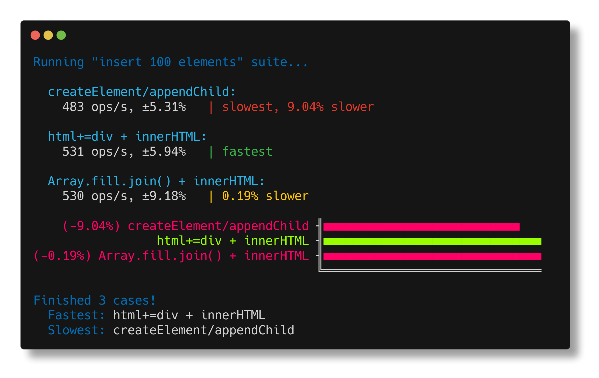

<h1 align="center">benny-vipu</h1>

<p align="center">
run <a href="https://github.com/caderek/benny">benny</a> benchmarks in the browser headless using <a href="https://github.com/stagas/vipu">vipu</a>
</p>

<p align="center">
   <a href="#install">        🔧 <strong>Install</strong></a>
 · <a href="#example">        🧩 <strong>Example</strong></a>
 · <a href="#api">            📜 <strong>API docs</strong></a>
 · <a href="https://github.com/stagas/benny-vipu/releases"> 🔥 <strong>Releases</strong></a>
 · <a href="#contribute">     💪🏼 <strong>Contribute</strong></a>
 · <a href="https://github.com/stagas/benny-vipu/issues">   🖐️ <strong>Help</strong></a>
</p>

---

## Install

```sh
$ npm i benny-vipu -g
```

## CLI

```
Usage: benny-vipu [options] <file>

                     <file>  Benchmark filename to run

   -c, --clear               Clear screen between page reloads
   -f, --force               Force cache renewal
   -d, --debug               Print debug information
   -p, --precision=n         Results decimal precision digits (default: 2)
   -s, --sort                Sort results by winners (default: false)
   -w, --width=n             Ascii chart width (default: 30)
       --min=n               Minimum iteration samples (default: 3)
       --max=n               Maximum time in seconds (default: 1)
```

## Example

```ts
import { suite, add, finish } from 'benny-vipu'

const container = document.body

const clear = () => (container.innerHTML = '')

const bench = async () => {
  for (const count of [100, 1_000, 10_000]) {
    await suite(
      `insert ${count} elements`,

      add('createElement/appendChild', () => {
        clear()
        for (let i = 0; i < count; i++) {
          const div = document.createElement('div')
          container.appendChild(div)
        }
      }),

      add('html+=div + innerHTML', () => {
        clear()
        let html = ''
        for (let i = 0; i < count; i++) {
          html += '<div></div>'
        }
        container.innerHTML = html
      }),

      add('Array.fill.join() + innerHTML', () => {
        clear()
        container.innerHTML = Array(count).fill('<div></div>').join('')
      }),
    )
  }
}

bench().then(finish)
```



## API

<!-- Generated by documentation.js. Update this documentation by updating the source code. -->

#### Table of Contents

- [run](#run)
  - [Parameters](#parameters)

### run

[src/index.ts:58-105](https://github.com/stagas/benny-vipu/blob/9d2000e013e6d7c5a17179c5486c5333a8bbbf77/src/index.ts#L58-L105 'Source code on GitHub')

Runs a given benchmark file.

#### Parameters

- `filename` **[string](https://developer.mozilla.org/docs/Web/JavaScript/Reference/Global_Objects/String)** The benchmark filename
- `options` **Options** (optional, default `new Options()`)

  - `options.clear` Clear screen between page reloads
  - `options.force` Force cache renewal
  - `options.debug` Print debug information
  - `options.precision` Results decimal precision digits (default: 2)
  - `options.sort` Sort results by winners (default: false)
  - `options.width` Ascii chart width (default: 30)
  - `options.minSamples` Minimum iteration samples (default: 3)
  - `options.maxTime` Maximum time in seconds (default: 1)

## Contribute

[Fork](https://github.com/stagas/benny-vipu/fork) or
[edit](https://github.dev/stagas/benny-vipu) and submit a PR.

All contributions are welcome!

## License

MIT © 2021
[stagas](https://github.com/stagas)
